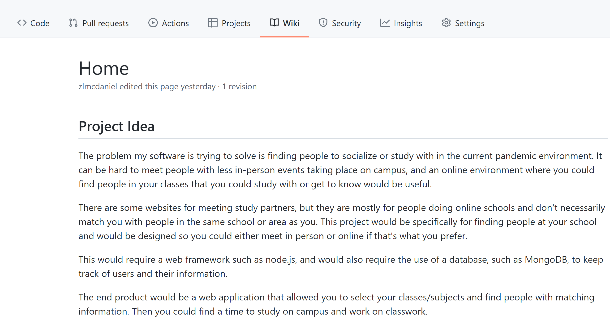
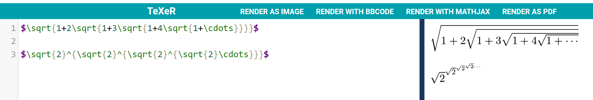
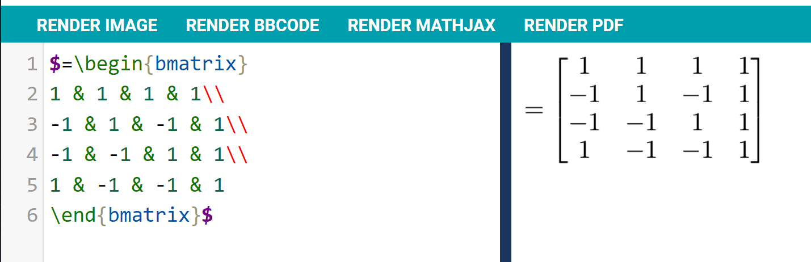
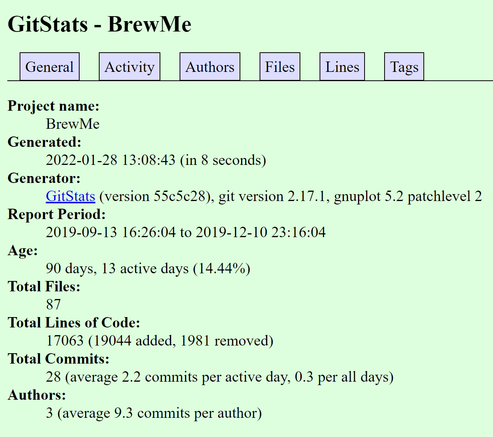
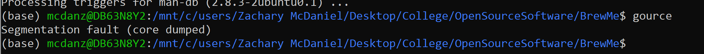

# Lab 03 Report - Git

## Part 1

2\. 

3\.

4\.

## Part 2

4/5\. BrewMe Project:

Number of contributers: 3

Number of lines of code: 24165

First commit: Commit 55ab008e940689ab6da10c83ac9e2abdb43b27dc on 9/13/19

Latest commit: Commit e62b2496df018ea1a48377030acf78e7ed984efe on 12/10/19

Current branches: master, jerryDev

For BrewMe the number of contributers, and the first/latest commit all match the previous exercise. The lines of code according to gitstats is only 17063, versus the 24165 I got from the github repo. And branches don't seem to be visible in GitStats, so there is no way to compare these.

BShare Project
**Project name**: BShare  
**Number of contributors**: 1  
**Number of lines of code**: 114638  
**First commit**: commit 32b9448f521a174351dabbc9f2698eecdd2e5b4c  
**Latest commit**: commit 2c2489d959fdb2130c7bd31830bada558d2db249  
**Current branches**:  
  
**Gitstats**  
  
The only difference that gitstats shows is the number of lines is 2257 compared to 114638 from the command. This is because the majority of those lines are from jpg files which are not counted by gitstats.

  

(markdown)
**Project name**: boxsplit  
**Number of contributors**: 5  
**Number of lines of code**: 9528  
**First commit**: commit 4da567408d794b9f23a3383090ab788b4d9bc2a3  
**Latest commit**: commit 03c7d625f086098eb5ada197984de21812c515c2  
**Current branches**:
* master  
* dependabot/npm_and_yarn/react-app/follow-redirects-1.14.7  
**Gitstats**  
  
The total lines of code on GitStats is 9074 while it is 9528 on GitHub. There were also 5 authors in GitHub, but GitStats has it recorded as 9. Judging from the graphs provided, it seems like there are some cases where some authors have worked on it from multiple accounts.  

=======================================================================
BLOCKZEUS
=======================================================================

## Blockzeus-desktop
Number of contributors: 3

Number of lines of code: 17438

First commit:

Latest commit:

Branches:

Gitstats instead shows 14871 lines of code, with 4 authors/contributors. The latest commit recording matches with that from the repository.

=======================================================================
BORILLIANT
=======================================================================
##Borilliant-Feedback
MOST RECENT COMMIT 

commit 3281cc4468b95db7e1887c8bd9ea490ca68989e6
Author: Yuze Ma <584653629@qq.com>
Date:   Thu Mar 2 20:41:09 2017 -0500

    Initial commit

LATEST COMMIT 
commit e32ac06077bbe16e5ffad0f599270e1e5a00bf64 (HEAD -> master, origin/master, origin/HEAD)
Merge: b876a54 565f24b
Author: Yuze Ma <584653629@qq.com>
Date:   Fri Apr 28 23:56:19 2017 -0400

    Merge pull request #10 from bobmayuze/ZiniuYu

    Frond end template design update

NUMBER CONTRIBUTORS

4 contributors

BRANCHES 
master

NUMBER LINES 
95401

GITSTATS

The total number of lines reported with gitstats is much higher than the lines found by running git ls-files -z | xargs -0 wc -l. All other statistics are consistent between the manual findings and gitstats.

6\. I had errors when trying to run gource:

