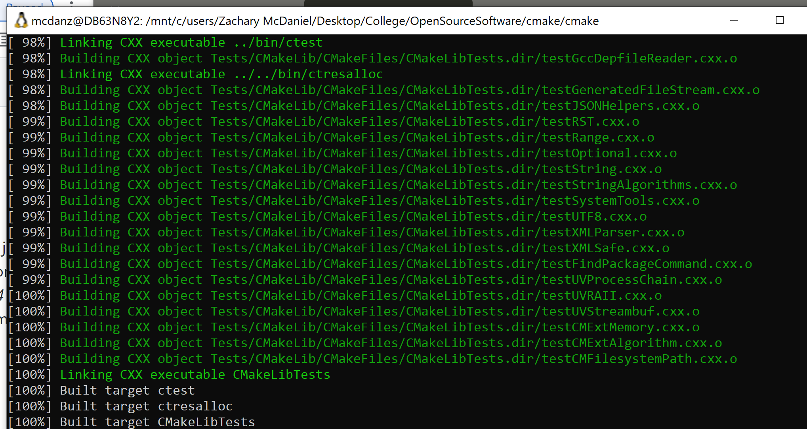

# Lab 07 Report - Testing and CI

1.

I had compiler issues with cmake-gui, but was able to build using 'cmake -G "Unix Makefiles" ../cmake'

Successful build:

2.

By going to nightly or experimental, we can see different submissions. When you click on one of them and scroll to the bottom, there is a View Test Summary link. This will show all the tests that were run, and whether they passed or failed.

The test for RunCMake.CompatibleInterface had an error. It shows the expected versus actual value in the comparison. The expected return value was \[1\], but it was \[Bus error\]. This makes it easy to see what went wrong in the code, and how you might be able to fix it.

In the masters section, I looked at a windows submission for cmake. It had 477 passed tests, and 1 failed test. The failed test was on the RunCMake.Syntax test. This probably isn't too bad, but could mean there will be issues regarding the correct syntax of cmake.

I ran the cmake tests and was able to see my experimental test results in the dashboard. It ran without any errors and all tests passed.

Experimental run in the cmake dashboard:

3.

Test error on Copyright test:

The Copyright test has an error stating that the file's copyright is earlier than the current year, so it's out of date. We can fix this by changing to copyright dates from 2000-2020 to 2000-2022

Change to file:

Successful run of tests:

4.

Repository Link: https://github.com/zlmcdaniel/Step5CmakeLab7

Successful pull request:

Successful push:

