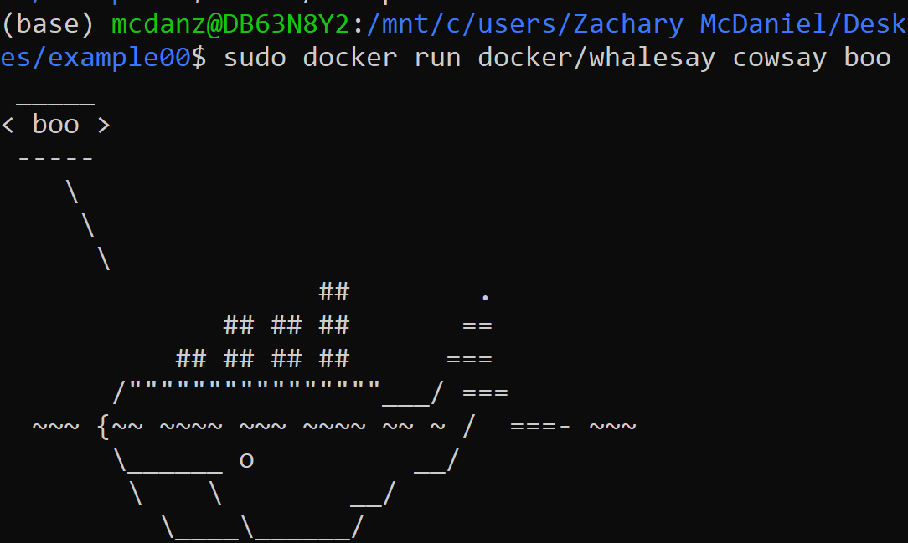

# Lab 08 Report - Virtualization and Docker

Running through examples with Docker:

Example 0: I ran the whalesay image and ASCII art of a whale saying boo appeared.

Example 1: I was able to start the ubuntu bash terminal within my terminal. I did apt update and installed vim, and then create a file called testFile in the /root directory. I then installed cowsay and was able to make it say different phrases after switching the user.

Example 2: I started the mongo image and then the Rocket.Chat application using the mongo image instance. I searched for localhost:3000 and the Rocket.Chat website came up. I then stopped the containers and removed the images.

Example 3: I made the Dockerfile as described in the example, and then built/ran the image. In localhost:5000 is was able to see the output message.

Example 4: 

I created the Dockerfile and docker-compose.yml file, built it, and then ran the service. I followed the instructions for adding/editing/removing messages and had the final result below.

