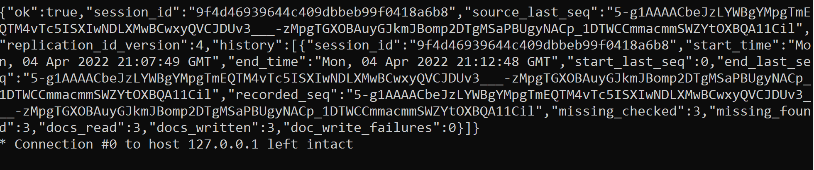

# Lab 09 Report - Databases

## Checkpoint 1:

Running CouchDB:

## Checkpoint 2:

After creating new databases:

Adding a document:

Running a query:

Replication:

## Checkpoint 3:

Creating a database:

Adding and getting a document:

Revisions and adding attachment:

Replication

## Checkpoint 4:

Select movies from 1987:

Select movies that come after L:

Adding an index on title:

Rerunning the movie title query:
