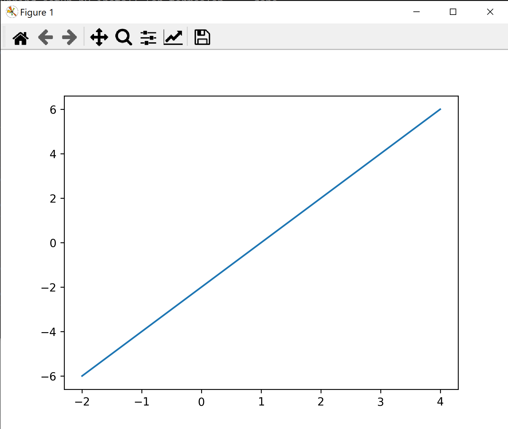
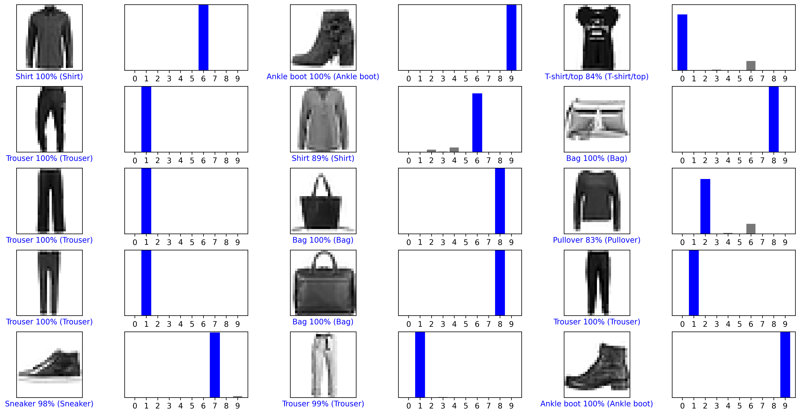
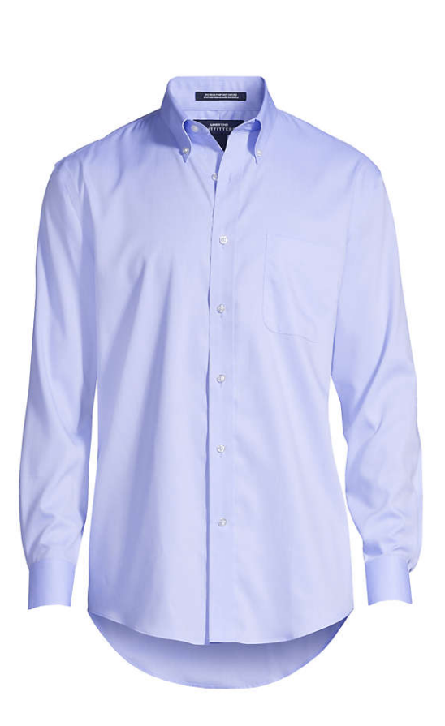
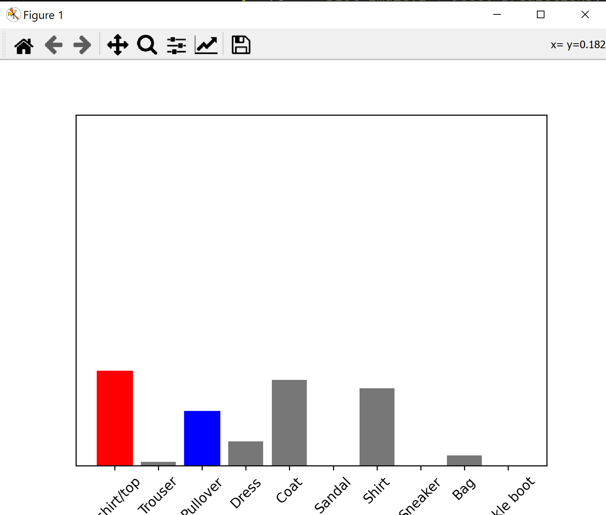
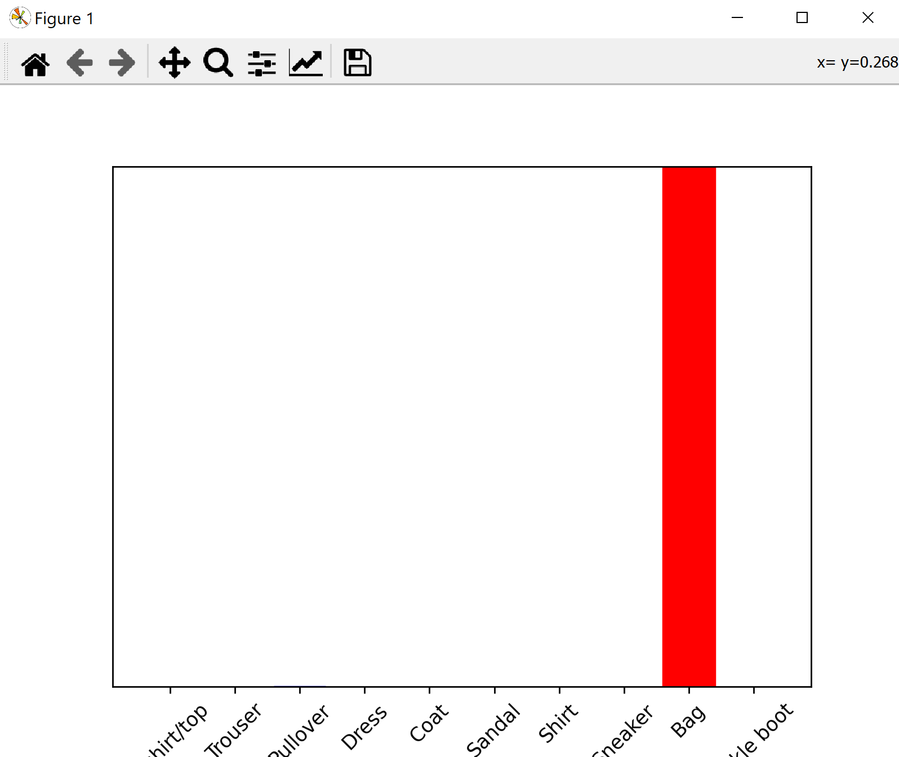
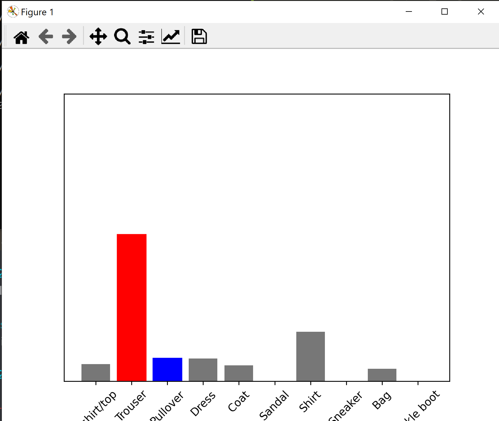

# Lab 10 Report - TensorFlow

## Checkpoint 1:



## Checkpoint 2:

```
# Plot the first X test images, their predicted label, and the true label
# Color correct predictions in blue, incorrect predictions in red
num_rows = 5
num_cols = 3
num_images = num_rows*num_cols
plt.figure(figsize=(2*2*num_cols, 2*num_rows))
for i in range(num_images):
  plt.subplot(num_rows, 2*num_cols, 2*i+1)
  plot_image(i + 9000, predictions[i + 9000], test_labels, test_images)
  plt.subplot(num_rows, 2*num_cols, 2*i+2)
  plot_value_array(i + 9000, predictions[i + 9000], test_labels)
plt.tight_layout()
plt.show()
```



## Checkpoint 3:

Clothing 1:

Original:



Greyscale:


Results:



Clothing 2:

Original:


Greyscale:


Results:



Clothing 3:

Original:


Greyscale:


Results:

